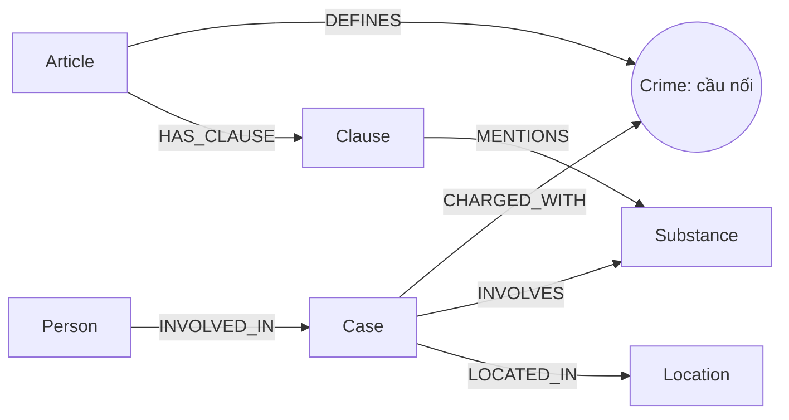

# Thiết kế Ontology — Day 19

**Họ tên:** Nguyễn Vũ Anh  **MSSV:** 2A202602502

**Lựa chọn** (đánh dấu một):
- [x] Dùng ontology gợi ý (có thể chỉnh nhỏ)
- [ ] Tự thiết kế (xét bonus +15, xem `SUBMISSION.md`)

> Hướng dẫn: `LAB_GUIDE.md` Bước 2. Dùng ontology gợi ý thì vẫn phải điền đủ các mục dưới đây bằng lời của bạn.

## 1. Sơ đồ

Vẽ bằng mermaid (hoặc chèn ảnh `report/img/ontology.png`). Đánh dấu rõ **node cầu nối**.

## 2. Entity types (node labels)

| Label | Ý nghĩa | Khóa định danh (`MERGE` theo) | Properties | Lấy từ KB nào | Trích bằng (regex / LLM / khác) |
| --- | --- | --- | --- | --- | --- |
| Article | Điều luật | id: Điều + luật | title, law, doc_id | Luật | Regex + metadata |
| Clause | Khoản luật | id: Điều + khoản | number, penalty, text, doc_id | Luật | Regex |
| Crime | Tội danh chuẩn | name | — | Cả hai | Tiêu đề luật; LLM + link_entity |
| Case | Vụ việc | name | summary, date, doc_id, source_title | Tin | LLM |
| Person | Người liên quan | name | aliases | Tin | LLM |
| Substance | Chất | name | — | Cả hai | Regex / LLM |
| Location | Địa phương | name | — | Tin | LLM |

Article, Clause và Case mang doc_id. Person, Crime, Substance và Location được dùng chung giữa nhiều tài liệu; truy nguồn người qua Case. Tất cả khóa có uniqueness constraint.

## 3. Relationships

| Type | Từ → Đến | Properties trên cạnh | Ý nghĩa |
| --- | --- | --- | --- |
| DEFINES | Article → Crime | — | Điều định nghĩa tội |
| HAS_CLAUSE | Article → Clause | — | Điều chứa khoản |
| MENTIONS | Clause → Substance | — | Khoản nhắc tới chất |
| CHARGED_WITH | Case → Crime | — | Tội được trích từ vụ |
| INVOLVES | Case → Substance | amount | Chất và khối lượng |
| LOCATED_IN | Case → Location | — | Địa phương của vụ |
| INVOLVED_IN | Person → Case | role, sentence, charge | Vai trò, mức án, tội của người |

## 4. Node cầu nối giữa 2 KB

- **Node nào:** Crime, qua Case → Crime ← Article.
- **Vì sao chọn node này:** Tội danh có ở cả luật lẫn tin, nối trực tiếp tới căn cứ luật.
- **Cách đảm bảo hai phía khớp tên:** Danh sách chuẩn lấy từ tiêu đề luật trong prompt; chuẩn hóa hai phía; exact match trước rồi fuzzy cutoff 0.8, giữ cách viết gốc.
- **Khi nào cầu gãy, và bạn xử lý thế nào:** Thiếu tội, JSON lỗi hoặc cách gọi quá khác. Không tạo tội đoán; kiểm tra Case thiếu CHARGED_WITH và đối chiếu bài nguồn. Fuzzy vẫn có thể nối nhầm tội gần tên.

## 5. Competency questions

Với mỗi câu trong `data/benchmark_kg.json`, ghi đường đi trên graph dùng để trả lời. Câu nào không trả lời được thì ghi rõ lý do.

| Câu | Đường đi (Cypher pattern) | Trả lời được? |
| --- | --- | --- |
| Q1 | Article → HAS_CLAUSE → Clause + chunk vector | Định nghĩa nằm trong text; phụ thuộc lấy đúng tài liệu luật. |
| Q2 | Person → INVOLVED_IN → Case | Đọc sentence của từng người; phụ thuộc trích xuất đúng. |
| Q3 | Person → Case → Crime ← Article → Clause | Mức án từ cạnh cá nhân, khung cơ bản từ khoản 1. |
| Q4 | Person (name/aliases) → Case → Crime ← Article → Clause | Lấy đủ khoản để có khung cao nhất dù khoản không nhắc chất. |
| Q5 | Person → Case → Substance; Case → Crime ← Article → Clause | Có amount và text ngưỡng, LLM phải so sánh đơn vị; graph chưa tự tính. |
| Q6 | Substance ← INVOLVES ← Case ← INVOLVED_IN ← Person | MDMA làm seed mở rộng ngoài top-k; max_facts có thể cắt dữ kiện. |

## 6. Quyết định thiết kế và đánh đổi

Ít nhất 3 quyết định. Mỗi quyết định ghi: đã chọn gì, phương án khác là gì, vì sao chọn.

1. Regex cho luật và LLM cho tin: rẻ, ổn định với cấu trúc khoản. LLM cho cả hai linh hoạt hơn nhưng đắt và dễ thay đổi kết quả; regex phụ thuộc định dạng nguồn.
2. Mức án trên cạnh Person → Case: giữ ngữ cảnh từng vụ, tốt hơn gắn lên người. Node Sentence riêng chi tiết hơn nhưng tăng độ phức tạp.
3. Lấy toàn bộ khoản của Điều liên quan thay vì lọc theo chất: tránh thiếu khung cao nhất, đổi lại prompt dài hơn. Giới hạn 60 facts ưu tiên luật trước tóm tắt, người và cạnh nên câu aggregation lớn có thể thiếu dữ kiện.
4. Giữ khóa tên theo gợi ý để dễ đối chiếu. ID theo nguồn và entity resolution giảm trùng nhưng cần thay ontology; hiện vẫn có nguy cơ gộp nhầm người trùng tên hoặc ghi đè vụ cùng tên.

## 7. So với ontology gợi ý (bắt buộc nếu xét bonus)

| Điểm khác | Gợi ý làm gì | Bạn làm gì | Vấn đề nó giải quyết | Bằng chứng (Cypher, hoặc số liệu benchmark) |
| --- | --- | --- | --- | --- |
| Không xét bonus | Giữ nguyên labels và quan hệ | Cải tiến retrieval, không thay ontology | Lấy đủ khoản và dữ kiện người của các vụ mở rộng | Cần benchmark thật để đo hiệu quả |

## 8. Hạn chế còn lại

Chưa chuẩn hóa đầy đủ tên đồng nghĩa Substance; chưa mô hình hóa điểm luật, ngưỡng, đơn vị và giai đoạn tố tụng. CHARGED_WITH phản ánh trích xuất, không chứng minh đã kết án. max_facts giới hạn số dòng, không giới hạn token. Cần đối chiếu labels/cạnh thực tế sau khi dựng đủ graph với API key.
